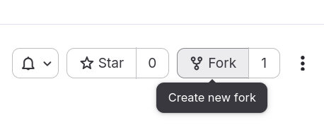
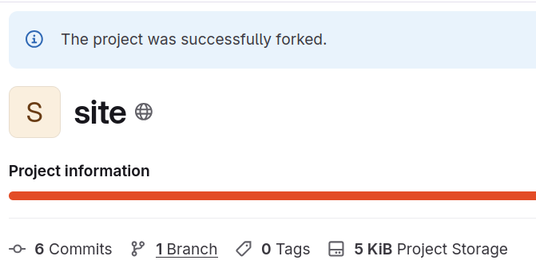

# compact-for-space

This repository contains the source code and build instructions for
building the COMPACT website.

## Contribution

To contribute to this project,
please follow the standard software development workflow:

### Quick Start (TL;DR)

1. Fork the repository
2. Branch for your changes (recommended)
3. Create your content and add yourself as contributor in `metadata.json`
4. Submit a Merge Request

### Detailed Steps

#### 1. create a fork

Create a fork of this repository to your own namespace
(e.g., your personal user space).
This allows you to make changes without affecting the main project.

#### 2. create a branch

While you can work directly in your fork, we highly recommend creating a
separate feature branch for your specific changes.
This makes it easier to sync updates from the upstream project and
manage multiple contributions.

Alternatively, you may use a single developer branch in your fork
if you wish to reduce the total number of branches.

#### Implement Changes

Create your content or fix the bugs.

Important: If you are adding a new page or significant content,
remember to add your name and details to `metadata.json` to be credited
as a contributor.

#### 4. create a merge request

Once you have pushed your changes to your fork, open a merge request (MR)
to the original repository. Please provide a clear description of the changes
you have made.

